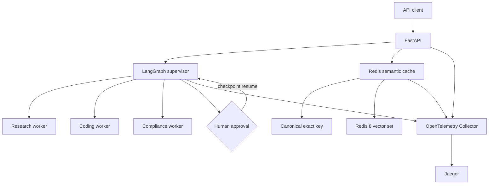

# FastAPI and LangGraph Production Agent Patterns

[](https://python.org)
[](https://fastapi.tiangolo.com)
[](https://langchain-ai.github.io/langgraph/)
[](https://redis.io)
[](https://opentelemetry.io)
[](LICENSE)

A production-oriented reference implementation for typed LangGraph supervisors,
human approval checkpoints, asynchronous token streaming, Redis 8 exact and
semantic caching, and end-to-end OpenTelemetry traces.

The default workers are deterministic and require no model key. Their boundaries
are designed to be replaced with provider-backed agents while retaining routing,
checkpointing, streaming, caching, and telemetry behavior.

## What this project proves

- A cyclic supervisor delegates to research, coding, and compliance specialists
  according to task content and risk.
- LangGraph checkpoints preserve full state across human approval interrupts and
  explicit `Command`-based resume calls.
- Async workers emit ordered tokens through LangGraph custom streams and a
  Server-Sent Events API.
- Redis 8 performs canonical exact lookup before native vector-set similarity,
  with TTL, distributed stampede locks, and tenant-scoped invalidation.
- OpenTelemetry links inbound HTTP spans to agent runs, specialist workers, and
  cache operations without recording prompt or response content.
- Ruff, strict Mypy, unit tests, Redis integration tests, and a latency benchmark
  run as CI gates.

The recorded local Redis 8.10.1 benchmark produced `0.245 ms` exact lookup p95
and `0.180 ms` exact eviction p95 over 1,000 iterations. See
[`docs/phase3.md`](docs/phase3.md) for methodology and scope.

## Architecture



## Quick start

### Complete stack

Docker Compose starts the API, Redis 8, OpenTelemetry Collector, and Jaeger:

```bash
docker compose up --build
```

- OpenAPI UI: `http://localhost:8002/docs`
- Liveness: `http://localhost:8002/health`
- Readiness: `http://localhost:8002/ready`
- Jaeger UI: `http://localhost:16686`

### Python development environment

```bash
python3 -m venv .venv
source .venv/bin/activate
python -m pip install -e ".[dev]"
cp .env.example .env
uvicorn main:app --app-dir src --host 0.0.0.0 --port 8002 --reload
```

Start Redis separately or set `AGENT_PATTERNS_CACHE_REQUIRED=false` when working
only on the agent graph.

## Agent API

Start a low-risk run:

```bash
curl -X POST http://localhost:8002/api/v1/agents/runs \
  -H 'content-type: application/json' \
  -d '{"task":"Implement and test a Python API"}'
```

Start a high-risk run. High risk always triggers the approval checkpoint:

```bash
curl -X POST http://localhost:8002/api/v1/agents/runs \
  -H 'content-type: application/json' \
  -d '{"task":"Deploy a payment API","risk_level":"high"}'
```

Resume using the returned thread ID:

```bash
curl -X POST http://localhost:8002/api/v1/agents/runs/THREAD_ID/approval \
  -H 'content-type: application/json' \
  -d '{"approved":true,"feedback":"Change window confirmed"}'
```

Stream token events:

```bash
curl -N -X POST http://localhost:8002/api/v1/agents/runs/stream \
  -H 'content-type: application/json' \
  -d '{"task":"Implement a Python test"}'
```

## Cache API

Write and retrieve a cache entry:

```bash
curl -X POST http://localhost:8002/api/v1/cache/entries \
  -H 'content-type: application/json' \
  -d '{"namespace":"support","model":"model-a","prompt":"How do I reset my password?","response":{"answer":"Open settings."}}'

curl -X POST http://localhost:8002/api/v1/cache/lookup \
  -H 'content-type: application/json' \
  -d '{"namespace":"support","model":"model-a","prompt":"How can I reset my password?"}'
```

The response identifies `exact` or `semantic` source and includes semantic
distance when applicable.

## Quality and performance gates

```bash
ruff check .
mypy
pytest
docker compose up -d redis
TEST_REDIS_URL=redis://localhost:6379/0 pytest tests/integration/test_redis_cache.py
python -m scripts.benchmark_cache --iterations 1000 --target-ms 5
```

## Configuration

All settings use the `AGENT_PATTERNS_` prefix. The important deployment values
are:

| Variable | Default | Purpose |
| --- | --- | --- |
| `REDIS_URL` | `redis://localhost:6379/0` | Cache connection |
| `CACHE_TTL_SECONDS` | `3600` | Entry expiration |
| `CACHE_VECTOR_DIMENSIONS` | `128` | Embedding width |
| `CACHE_SEMANTIC_DISTANCE_THRESHOLD` | `0.12` | Maximum cosine distance |
| `CACHE_REQUIRED` | `true` | Whether Redis gates readiness |
| `DEPENDENCY_TIMEOUT_SECONDS` | `0.5` | Readiness dependency timeout |
| `OTLP_ENDPOINT` | unset | OTLP HTTP trace endpoint |

## Phase documentation

- [OpenAPI and HTTP API reference](docs/openapi.md)
- [Phase 1: Production service foundation](docs/phase1.md)
- [Phase 2: Stateful supervisor, approval, and streaming](docs/phase2.md)
- [Phase 3: Redis 8 exact and semantic cache](docs/phase3.md)
- [Phase 4: Observability and deployment hardening](docs/phase4.md)

Each document explains design decisions, files, behavior, verification, and the
handoff to the following phase.

## Production extension points

- Replace deterministic workers with LLM clients at the worker node boundary.
- Replace `InMemorySaver` with a database-backed LangGraph checkpointer when
  checkpoints must survive process replacement.
- Replace `HashingEmbedder` with the deployment's embedding model while keeping
  vector dimensions consistent across writers and Redis vector sets.
- Apply authentication and tenant authorization at the API gateway or route
  dependency before accepting untrusted traffic.
- Rerun the cache benchmark in the target network topology before repeating a
  latency claim.

## License

MIT. See [LICENSE](LICENSE).

## Author

Vinay K R, Senior GenAI and Applied AI Systems Engineer

- Portfolio: [portfolio.vinaykr.workers.dev](https://portfolio.vinaykr.workers.dev/)
- LinkedIn: [linkedin.com/in/vi-naykr](https://linkedin.com/in/vi-naykr)
- GitHub: [github.com/vi-nayKR](https://github.com/vi-nayKR)
