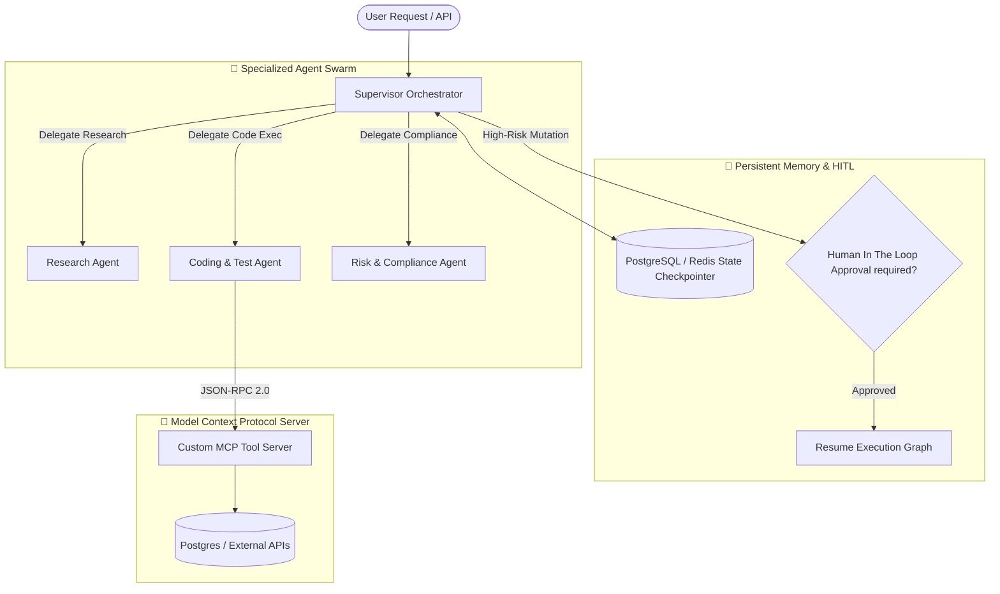

# 🤖 FastAPI & LangGraph Production Agent Patterns

[](https://python.org)
[](https://fastapi.tiangolo.com)
[](https://langchain-ai.github.io/langgraph/)
[](https://opentelemetry.io)
[](https://modelcontextprotocol.io/)
[](LICENSE)

A clean, production-grade reference architecture for building **stateful, observable Multi-Agent AI systems** using **Python FastAPI**, **LangGraph cyclic state machines**, **Model Context Protocol (MCP) tool servers**, and **OpenTelemetry distributed tracing**.

---

## 🏛️ Architecture & Agent Topology



---

## ✨ Features Included

1. **Stateful Multi-Agent Supervisor Pattern:**
   - Typed graph states with dynamic worker delegation, loop prevention, and error escalation.
2. **Human-in-the-Loop (HITL) Checkpoints:**
   - Interrupt graph execution before sensitive database mutations, await human manager approval via REST API, and resume state without context loss.
3. **Model Context Protocol (MCP) Server:**
   - Out-of-the-box MCP server implementation exposing tools for SQL generation, API querying, and security validation.
4. **End-to-End OpenTelemetry Tracing:**
   - Automatic distributed trace injection linking HTTP requests, LLM token generations, tool invocations, and database queries.

---

## ⚡ Quickstart

```bash
git clone https://github.com/vi-nayKR/fastapi-genai-agent-patterns.git
cd fastapi-genai-agent-patterns

python3 -m venv .venv
source .venv/bin/activate
pip install -r requirements.txt

uvicorn src.main:app --host 0.0.0.0 --port 8002 --reload
```

---

## 👤 Author
**Vinay K R** — *Senior GenAI & Applied AI Systems Engineer*  
- 🌐 Portfolio: [portfolio.vinaykr.workers.dev](https://portfolio.vinaykr.workers.dev/)  
- 💼 LinkedIn: [linkedin.com/in/vi-naykr](https://linkedin.com/in/vi-naykr)  
- 🐙 GitHub: [github.com/vi-nayKR](https://github.com/vi-nayKR)  
