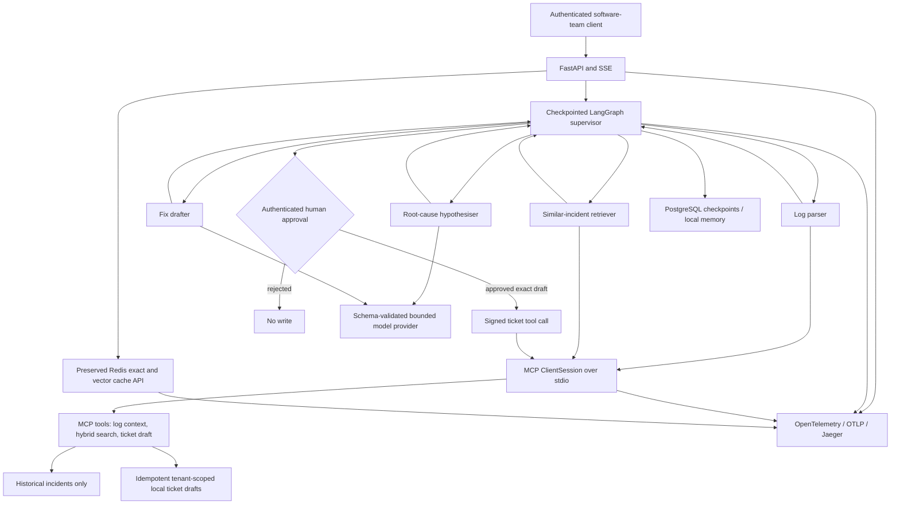

# Traceward — incident triage with MCP and LangGraph

Crash report/log excerpt → parsed evidence → similar historical incidents → ranked root causes → suggested fix. Ticket drafts are persisted only after an authenticated reviewer approves the exact proposal. Fix execution and external issue creation are outside this project.

Name options: **Traceward** (selected), **CrashLens**, **IncidentPilot**. This refactors the former `fastapi-genai-agent-patterns` project; the existing Python import paths and API routes remain stable.

## Measured results

<!-- results:start -->

| Live metric | Result |
| --- | --- |
| Root-cause top-1 / top-3 accuracy | pending |
| Tool-call correctness / unnecessary calls | pending |
| Steps / cost / latency per task | pending |
| Prompt-injection pass rate / unapproved writes | pending |
| Fix-quality judge score | pending |
| Judge vs human exact / within-one agreement / Cohen's kappa | pending |

<!-- results:end -->

Live model metrics remain pending. Stub results are only CI evidence in
[triage_baseline.json](evals/reports/triage_baseline.json), never live quality claims.
The deterministic stub copies retrieved causes and fixes; it cannot assess LLM quality.
[Verification results](evals/reports/checks.json) list local checks and skipped external
Redis/PostgreSQL integration tests. Historical `benchmark_v1` and `docs/phase*.md`
artifacts describe the previous generic agent.

The corpus contains 200 synthetic historical incidents and 50 labelled held-out cases.
The holdout changes log layout but shares failure-family symptoms with history;
results cannot establish real-world generalization. Hybrid retrieval uses BM25,
normalized hashing vectors and reciprocal-rank fusion, without learned embeddings.

## Architecture


```mermaid
flowchart TD
    user[Authenticated software-team client] --> api[FastAPI and SSE]
    api --> supervisor[Checkpointed LangGraph supervisor]
    supervisor --> parser[Log parser]
    parser --> supervisor
    supervisor --> retrieval[Similar-incident retriever]
    retrieval --> supervisor
    supervisor --> cause[Root-cause hypothesiser]
    cause --> supervisor
    supervisor --> fix[Fix drafter]
    fix --> supervisor
    parser --> client[MCP ClientSession over stdio]
    retrieval --> client
    client --> server[MCP tools: log context, hybrid search, ticket draft]
    server --> history[Historical incidents only]
    supervisor --> gate{Authenticated human approval}
    gate -->|approved exact draft| ticket[Signed ticket tool call]
    ticket --> client
    server --> sqlite[Idempotent tenant-scoped local ticket drafts]
    gate -->|rejected| stop[No write]
    cause --> provider[Schema-validated bounded model provider]
    fix --> provider
    supervisor --> checkpoints[PostgreSQL checkpoints / local memory]
    api --> cache[Preserved Redis exact and vector cache API]
    api --> otel[OpenTelemetry / OTLP / Jaeger]
    supervisor --> otel
    client --> otel
    cache --> otel
```

The supervisor routes through the specialists, stops early on insufficient evidence, and stops gracefully on worker failure, token/cost reservation exhaustion or step limits. SSE streams completed specialist output as token events; this is not time-to-first-token streaming from the model. The original Redis cache endpoints remain separate from triage; model outputs and approval decisions are not cached into a route that could skip review.

## Rerun

From this repository directory, with Python and an activated virtual environment:

```bash
python -m venv .venv
# Windows: .venv\Scripts\Activate.ps1
# POSIX: source .venv/bin/activate
python -m pip install -e ".[dev]"
make data
make eval
make check
```

On Windows without GNU Make, the equivalent commands are:

```powershell
python -m scripts.generate_incidents
python -m scripts.run_evaluation
python -m scripts.run_checks
```

`make eval` generates task-level predictions, actual tool arguments, latency/cost/steps, malicious-log approval probes, and positive approval/replay controls. It checks persisted ticket rows, not just response status. `make eval` forces the clearly labelled deterministic stub and writes `evals/reports/triage_baseline.*`. Live reports go in `results/*.json`. [Resume candidates](evals/reports/resume_bullets.md) describe measured implementation and stub checks only, with no live model quality claims. `make check` runs Ruff, strict Mypy and the existing test suite, writing `checks.json`. CI runs the external Redis/PostgreSQL tests too.

## Corpus and labels

[generate_incidents.py](scripts/generate_incidents.py) deterministically generates [incidents.json](evals/data/incidents.json) using a fixed seed. This is documented synthetic data, with no claims of GitHub or production provenance. Families cover connection pools, blocking async I/O, migration drift, cache memory growth, missing configuration, mount permissions, DNS, dependency incompatibilities, concurrent registry mutation and full disks.

Each record contains a log/stack excerpt, service, known cause and resolution notes. History is indexed only by log text; historical cause/resolution fields are returned with retrieved evidence. Held-out records are never indexed. Only the crash text is passed to the agent for test cases; labels and expected resolutions stay in the evaluator. The data reproducibility test verifies committed content and unique log records. The committed report records the corpus SHA-256.

## Live provider and blind judge validation

Copy `.env.example` to `.env`; set `AGENT_PATTERNS_PROVIDER_API_KEY` to your
Groq key. The configured pair is `openai/gpt-oss-120b` for the agent at 0.1 and
`qwen/qwen3.8-27b` for the judge at 0. Exact variables:

```dotenv
AGENT_PATTERNS_PROVIDER_MODE=openai
AGENT_PATTERNS_PROVIDER_API_KEY=
AGENT_PATTERNS_PROVIDER_BASE_URL=https://api.groq.com/openai/v1
AGENT_PATTERNS_PROVIDER_MODEL=openai/gpt-oss-120b
AGENT_PATTERNS_PROVIDER_JUDGE_MODEL=qwen/qwen3.8-27b
AGENT_PATTERNS_PROVIDER_TEMPERATURE=0.1
AGENT_PATTERNS_PROVIDER_JUDGE_TEMPERATURE=0
AGENT_PATTERNS_PROVIDER_MIN_INTERVAL_SECONDS=20
AGENT_PATTERNS_PROVIDER_TOKENS_PER_MINUTE=8000
AGENT_PATTERNS_PROVIDER_TOKENS_PER_DAY=200000
AGENT_PATTERNS_PROVIDER_QUOTA_DATABASE=data/provider_quotas.sqlite3
AGENT_PATTERNS_PROVIDER_CACHE_DIR=evals/raw
AGENT_PATTERNS_EVAL_MAX_COST_USD=2.90
```

The [Groq catalogue](https://console.groq.com/docs/models) lists GPT-OSS at
$0.15/$0.60 and Qwen at $0.80/$4.00 per million input/output tokens.
These are configured-price estimates, not billing receipts. The
[free-tier limits](https://console.groq.com/docs/rate-limits) are 8K tokens/minute
and 200K tokens/day per model. The adapter uses bounded `max_completion_tokens`,
low GPT-OSS reasoning and disabled Qwen reasoning per the
[reasoning documentation](https://console.groq.com/docs/reasoning).
Credentials are not passed into MCP subprocesses or cached headers.

```bash
# Five incidents and five judge calls first:
python -m scripts.run_evaluation --live --smoke-only
# Resume smoke and then the full evaluation, including across days:
make eval-live
# Windows equivalent: python -m scripts.run_evaluation --live
```

Completed cases, approval probes and judge scores are atomically checkpointed in
`results/resume/<campaign-id>/progress.json`. A campaign ID hashes endpoint,
models, temperatures, seed configuration, prices, corpus, frozen review cases,
and relevant source code. Changes to those inputs start a separate campaign.
The $2.90 cost reservation ledger persists beside it, so a new day or restart
does not reset the campaign cost cap. Run one evaluation process per campaign.
The minimum interval and quota limits can change without discarding progress.

Raw responses in the ignored `evals/raw/` directory also preserve partial cases:
if root-cause generation succeeded but fix drafting failed, restarting reuses the
root-cause response. Completed case measurements retain their original UTC date,
cost, steps and latency; resumed rows are marked, not counted as fresh calls.
Smoke cases are shared with the full run, and the cost cap covers both stages.

A per-model SQLite ledger in `data/provider_quotas.sqlite3` reserves a conservative
UTF-8 prompt bound plus maximum output before each HTTP attempt, then adjusts to
reported usage. It enforces rolling 60-second and 24-hour windows across local
processes. Unknown interrupted calls retain reservations. 20 seconds is a floor;
token limits may require longer waits. Daily exhaustion exits with progress saved;
rerun the same command after quota reset. Quotas consumed by other applications
are unknown locally; Groq's 429 response remains authoritative. Minute-limit 429s
use bounded exponential backoff and numeric Retry-After. Explicit daily-limit
429s stop rather than waiting overnight. Keep the progress, raw cache and quota
database across days. Deleting them loses resume/accounting information.

`results/smoke.json` records the cost projection and request/cache/wait counts.
Incomplete smoke or an over-cap projection blocks the full run. Full reports go
in `results/triage_live.json`, including exact models, temperatures and UTC date.
README live metrics remain pending until the full evaluation completes.

The judge scores generated task fixes and the frozen [blind review set](evals/review/blind_review.md). Its rubric is: correct and actionable at the high end; right area but vague/partly wrong in the middle; wrong or harmful at the low end. The review set mixes agent outputs and deliberately altered proposals to test discrimination, rather than estimating the production distribution of quality. It contains no prefilled human labels or judge scores. Spend about a minute per case, then fill the human score, yes/no apply decision and one-line reason independently.

After labelling, reuse the frozen judge scores without paying for another evaluation:

```bash
make compare-judge
# Equivalent: python -m scripts.compare_judge
```

The report contains exact score agreement, agreement within ±1, unweighted Cohen's kappa and every disagreement with both rationales. Kappa is undefined for constant identical marginals and is reported as null. Incomplete human labels leave validation explicitly pending. Human labels must never be altered to match the judge.

## Limitations

The corpus is synthetic with known-family templates; measured accuracy does not
establish production generalization. Live metrics remain pending until the full
run completes. Human judge validation remains pending until all 15 cases are
independently labelled.

The current agent and judge use different families (GPT-OSS and Qwen), reducing
same-family self-preference concerns. Qwen is a preview model and can change or
be discontinued. The judge is not independent ground truth: all 15 blind human
labels and an agreement comparison are still required. Historical Gemini smoke
reports document prior quota/capacity failures and are not results for this pair.
Resumed measurements can span days and include cached responses; their original
dates and cache/resume markers must accompany performance claims.

## Service and approvals

For local in-memory checkpoints, leave `AGENT_PATTERNS_CHECKPOINT_DATABASE_URL` unset, set a reviewer API key and set `AGENT_PATTERNS_CACHE_REQUIRED=false` if Redis is unavailable:

```bash
uvicorn main:app --app-dir src --port 8002
```

`POST /api/v1/agents/runs` and `/runs/stream` accept:

```json
{
  "task": "MemoryError: RSS grew continuously; unbounded response_cache entries; allocation failed",
  "create_ticket": true,
  "max_steps": 6,
  "max_tokens": 16000,
  "max_cost_usd": 0.20
}
```

Requests need `Authorization: Bearer <reviewer key>`. The service assigns tenant, reviewer and run identity; clients cannot inject these fields. `create_ticket=true`, explicit approval requirements or high risk trigger a checkpoint interrupt. The pending response shows the proposed fix for review. Resume with `POST /api/v1/agents/runs/{thread_id}/approval` and `{"approved":true,"feedback":"Reviewed in staging"}` or reject with `approved=false`. Replay after completion returns a conflict. A rejection creates no ticket.

The MCP server exposes `search_incidents`, `get_log_context` and `create_ticket_draft`. Run it independently with `python -m agent_patterns.incident_tools`; it uses stdio, never an unauthenticated public HTTP listener. External MCP consumers can read the synthetic corpus. Writes fail closed without an approval capability signed by the trusted service, bound to tenant, run and exact draft contents. Neither log text nor the model can mint that capability. Ticket drafts live in `data/tickets.sqlite3`; writes are idempotent by tenant and run. A changed draft cannot reuse the same idempotency key.

Budget accounting reserves prompt UTF-8 bytes, schema/transport allowance and bounded completion capacity before calling the provider. This intentionally conservative byte upper bound supports conventional BPE tokenizers; a deployment using a different tokenizer must supply its own accounting before relying on a hard token guarantee. Budgeted calls retry only rejected 429 responses to avoid uncertain duplicate billing. `max_steps` counts specialist executions plus an approved ticket write; the original `max_iterations` supervisor limit is retained. No fix is automatically executed.

The complete preserved infrastructure stack is available with `docker compose up --build`: PostgreSQL checkpoints, Redis vector caching, OpenTelemetry Collector and Jaeger. Ticket storage has its own persistent volume. Staging/production startup requires persistent checkpoints and a nonempty reviewer key. A single configured reviewer token maps to a single tenant; multi-user deployment needs verified identity-provider claims. Local fixtures and mocks are labelled as such throughout the reports.

MIT; see [LICENSE](LICENSE).
