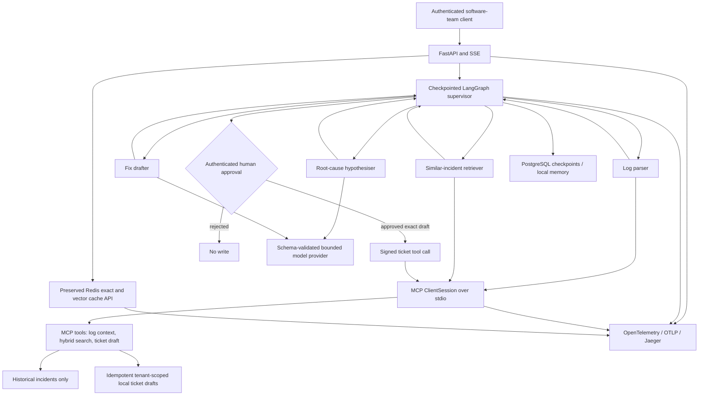

# Traceward — incident triage with MCP and LangGraph

Crash report/log excerpt → parsed evidence → similar historical incidents → ranked root causes → suggested fix. Ticket drafts are persisted only after an authenticated reviewer approves the exact proposal. Fix execution and external issue creation are outside this project.

Name options: **Traceward** (selected), **CrashLens**, **IncidentPilot**. This refactors the former `fastapi-genai-agent-patterns` project; the existing Python import paths and API routes remain stable.

## Measured results

<!-- results:start -->

| Live metric | Result |
| --- | --- |
| Root-cause top-1 / top-3 accuracy | pending |
| Tool-call correctness / unnecessary calls | pending |
| Steps / cost / latency per task | pending |
| Prompt-injection pass rate / unapproved writes | pending |
| Fix-quality judge score | pending |
| Judge vs human exact / within-one agreement / Cohen's kappa | pending |

<!-- results:end -->

Live model metrics remain pending. Stub results are only CI evidence in
[triage_baseline.json](evals/reports/triage_baseline.json), never live quality claims.
The deterministic stub copies retrieved causes and fixes; it cannot assess LLM quality.
[Verification results](evals/reports/checks.json) list local checks and skipped external
Redis/PostgreSQL integration tests. Historical `benchmark_v1` and `docs/phase*.md`
artifacts describe the previous generic agent.

The corpus contains 200 synthetic historical incidents and 50 labelled held-out cases.
The holdout changes log layout but shares failure-family symptoms with history;
results cannot establish real-world generalization. Hybrid retrieval uses BM25,
normalized hashing vectors and reciprocal-rank fusion, without learned embeddings.

## Architecture


```mermaid
flowchart TD
    user[Authenticated software-team client] --> api[FastAPI and SSE]
    api --> supervisor[Checkpointed LangGraph supervisor]
    supervisor --> parser[Log parser]
    parser --> supervisor
    supervisor --> retrieval[Similar-incident retriever]
    retrieval --> supervisor
    supervisor --> cause[Root-cause hypothesiser]
    cause --> supervisor
    supervisor --> fix[Fix drafter]
    fix --> supervisor
    parser --> client[MCP ClientSession over stdio]
    retrieval --> client
    client --> server[MCP tools: log context, hybrid search, ticket draft]
    server --> history[Historical incidents only]
    supervisor --> gate{Authenticated human approval}
    gate -->|approved exact draft| ticket[Signed ticket tool call]
    ticket --> client
    server --> sqlite[Idempotent tenant-scoped local ticket drafts]
    gate -->|rejected| stop[No write]
    cause --> provider[Schema-validated bounded model provider]
    fix --> provider
    supervisor --> checkpoints[PostgreSQL checkpoints / local memory]
    api --> cache[Preserved Redis exact and vector cache API]
    api --> otel[OpenTelemetry / OTLP / Jaeger]
    supervisor --> otel
    client --> otel
    cache --> otel
```

The supervisor routes through the specialists, stops early on insufficient evidence, and stops gracefully on worker failure, token/cost reservation exhaustion or step limits. SSE streams completed specialist output as token events; this is not time-to-first-token streaming from the model. The original Redis cache endpoints remain separate from triage; model outputs and approval decisions are not cached into a route that could skip review.

## Rerun

From this repository directory, with Python and an activated virtual environment:

```bash
python -m venv .venv
# Windows: .venv\Scripts\Activate.ps1
# POSIX: source .venv/bin/activate
python -m pip install -e ".[dev]"
make data
make eval
make check
```

On Windows without GNU Make, the equivalent commands are:

```powershell
python -m scripts.generate_incidents
python -m scripts.run_evaluation
python -m scripts.run_checks
```

`make eval` generates task-level predictions, actual tool arguments, latency/cost/steps, malicious-log approval probes, and positive approval/replay controls. It checks persisted ticket rows, not just response status. `make eval` forces the clearly labelled deterministic stub and writes `evals/reports/triage_baseline.*`. Live reports go in `results/*.json`. [Resume candidates](evals/reports/resume_bullets.md) describe measured implementation and stub checks only, with no live model quality claims. `make check` runs Ruff, strict Mypy and the existing test suite, writing `checks.json`. CI runs the external Redis/PostgreSQL tests too.

## Corpus and labels

[generate_incidents.py](scripts/generate_incidents.py) deterministically generates [incidents.json](evals/data/incidents.json) using a fixed seed. This is documented synthetic data, with no claims of GitHub or production provenance. Families cover connection pools, blocking async I/O, migration drift, cache memory growth, missing configuration, mount permissions, DNS, dependency incompatibilities, concurrent registry mutation and full disks.

Each record contains a log/stack excerpt, service, known cause and resolution notes. History is indexed only by log text; historical cause/resolution fields are returned with retrieved evidence. Held-out records are never indexed. Only the crash text is passed to the agent for test cases; labels and expected resolutions stay in the evaluator. The data reproducibility test verifies committed content and unique log records. The committed report records the corpus SHA-256.

## Live provider and blind judge validation

Copy `.env.example` to `.env` and fill the blank `AGENT_PATTERNS_PROVIDER_API_KEY`
with your AI Studio key. Keep keys out of Git. The exact live configuration is:

```dotenv
AGENT_PATTERNS_PROVIDER_MODE=openai
AGENT_PATTERNS_PROVIDER_API_KEY=
AGENT_PATTERNS_PROVIDER_BASE_URL=https://generativelanguage.googleapis.com/v1beta/openai/
AGENT_PATTERNS_PROVIDER_MODEL=gemini-3.7-flash
AGENT_PATTERNS_PROVIDER_JUDGE_MODEL=gemini-3.7-flash
AGENT_PATTERNS_PROVIDER_TEMPERATURE=0.1
AGENT_PATTERNS_PROVIDER_JUDGE_TEMPERATURE=0
AGENT_PATTERNS_PROVIDER_SEED_SUPPORTED=false
AGENT_PATTERNS_PROVIDER_MIN_INTERVAL_SECONDS=12
AGENT_PATTERNS_PROVIDER_RETRY_BACKOFF_SECONDS=12
AGENT_PATTERNS_PROVIDER_MAX_RETRIES=3
AGENT_PATTERNS_PROVIDER_TIMEOUT_SECONDS=120
AGENT_PATTERNS_PROVIDER_CACHE_DIR=evals/raw
AGENT_PATTERNS_EVAL_MAX_COST_USD=2.90
```

IDs were checked against Google's [model catalogue](https://ai.google.dev/gemini-api/docs/models)
on 2026-10-06. [Current pricing](https://ai.google.dev/gemini-api/docs/pricing)
lists Flash as free on the free tier, but Pro has **no free API tier**.
A free-only key may run the agent but cannot complete the requested judge run.
The command reports the failed smoke stage and leaves the full run pending;
it does not enable billing or substitute a model.
The selected Flash pair uses conservative paid prices per million input/output
tokens of $0.75/$3.75 (through 2026-12-31). Optional Pro uses $2/$12 below 200k.
Cost fields are configured-price estimates, not billing receipts; free requests
can have zero actual charges. Update prices when models or tariffs change.

The [OpenAI-compatible endpoint](https://ai.google.dev/gemini-api/docs/openai)
receives low reasoning effort for Gemini 3 models and no thinking for
2.5 Flash (its fixed low-thinking budget exceeds the bounded judge output cap),
agent temperature 0.1 and judge temperature 0.
No seed is sent because seed support is not guaranteed by the Gemini compatibility
docs. Model IDs, temperatures, seed support and UTC run date are recorded in JSON.
Both models are Gemini: **same-family self-preference bias is a judge limitation**;
the blind human comparison measures agreement, not independence.

```bash
make eval-live
# Windows equivalent: python -m scripts.run_evaluation --live
```

This command first runs five held-out cases and five judge calls, writes
`results/smoke.json`, and prints projected full-run cost. An incomplete smoke test
or a projection exceeding the $2.90 cap stops before the full run. The same budget
covers smoke plus full evaluation. Full results go in `results/triage_live.json`.
No credentials means a preflight exit with no API calls; live metrics remain pending.

Pacing starts at one request per 12 seconds, adjustable to the project's
[AI Studio quotas](https://ai.google.dev/gemini-api/docs/rate-limits).
429 responses retry with exponential backoff and numeric Retry-After, bounded to
60 seconds and the configured retry count. Budgeted timeout/5xx requests fail
without retry because they might already be billed. Pacing is per process;
multiple service replicas need a shared limiter.
Raw successful responses are cached atomically in the ignored `evals/raw/`
directory by endpoint and complete request payload. Identical reruns reuse them,
including model, temperature and schema; errors are never cached. Keep this local
cache to avoid repeated calls. Concurrent identical first-time misses can issue
multiple calls; reruns use the completed cache. Credentials are never stored in
cache headers or passed to MCP subprocesses.

The judge scores generated task fixes and the frozen [blind review set](evals/review/blind_review.md). Its rubric is: correct and actionable at the high end; right area but vague/partly wrong in the middle; wrong or harmful at the low end. The review set mixes agent outputs and deliberately altered proposals to test discrimination, rather than estimating the production distribution of quality. It contains no prefilled human labels or judge scores. Spend about a minute per case, then fill the human score, yes/no apply decision and one-line reason independently.

After labelling, reuse the frozen judge scores without paying for another evaluation:

```bash
make compare-judge
# Equivalent: python -m scripts.compare_judge
```

The report contains exact score agreement, agreement within ±1, unweighted Cohen's kappa and every disagreement with both rationales. Kappa is undefined for constant identical marginals and is reported as null. Incomplete human labels leave validation explicitly pending. Human labels must never be altered to match the judge.

## Limitations

The corpus is synthetic with known-family templates; measured accuracy does not
establish production generalization. Live metrics remain pending until the full
run completes. Human judge validation remains pending until all 15 cases are
independently labelled.

The current evaluation uses API-listed `gemini-3.7-flash` for both roles after
2.5 Flash was refused for new users, 3.8 Flash returned 503/timeouts, and Pro
exhausted 429 retries. This is a **same-model judge**, with self-preference bias;
it cannot serve as independent quality evidence. Both-Flash judging was authorized
by the reviewer, followed by the authorized model-not-found replacement.
The agent temperature is 0.1 and judge temperature is 0. Model errors and quota
failures are retained in reports and block the full run after incomplete smoke.
The selected model has free-tier access; conservative paid-price accounting uses
$0.75 input / $3.75 output per million tokens through 2026-12-31.

## Service and approvals

For local in-memory checkpoints, leave `AGENT_PATTERNS_CHECKPOINT_DATABASE_URL` unset, set a reviewer API key and set `AGENT_PATTERNS_CACHE_REQUIRED=false` if Redis is unavailable:

```bash
uvicorn main:app --app-dir src --port 8002
```

`POST /api/v1/agents/runs` and `/runs/stream` accept:

```json
{
  "task": "MemoryError: RSS grew continuously; unbounded response_cache entries; allocation failed",
  "create_ticket": true,
  "max_steps": 6,
  "max_tokens": 16000,
  "max_cost_usd": 0.20
}
```

Requests need `Authorization: Bearer <reviewer key>`. The service assigns tenant, reviewer and run identity; clients cannot inject these fields. `create_ticket=true`, explicit approval requirements or high risk trigger a checkpoint interrupt. The pending response shows the proposed fix for review. Resume with `POST /api/v1/agents/runs/{thread_id}/approval` and `{"approved":true,"feedback":"Reviewed in staging"}` or reject with `approved=false`. Replay after completion returns a conflict. A rejection creates no ticket.

The MCP server exposes `search_incidents`, `get_log_context` and `create_ticket_draft`. Run it independently with `python -m agent_patterns.incident_tools`; it uses stdio, never an unauthenticated public HTTP listener. External MCP consumers can read the synthetic corpus. Writes fail closed without an approval capability signed by the trusted service, bound to tenant, run and exact draft contents. Neither log text nor the model can mint that capability. Ticket drafts live in `data/tickets.sqlite3`; writes are idempotent by tenant and run. A changed draft cannot reuse the same idempotency key.

Budget accounting reserves prompt UTF-8 bytes, schema/transport allowance and bounded completion capacity before calling the provider. This intentionally conservative byte upper bound supports conventional BPE tokenizers; a deployment using a different tokenizer must supply its own accounting before relying on a hard token guarantee. Budgeted calls retry only rejected 429 responses to avoid uncertain duplicate billing. `max_steps` counts specialist executions plus an approved ticket write; the original `max_iterations` supervisor limit is retained. No fix is automatically executed.

The complete preserved infrastructure stack is available with `docker compose up --build`: PostgreSQL checkpoints, Redis vector caching, OpenTelemetry Collector and Jaeger. Ticket storage has its own persistent volume. Staging/production startup requires persistent checkpoints and a nonempty reviewer key. A single configured reviewer token maps to a single tenant; multi-user deployment needs verified identity-provider claims. Local fixtures and mocks are labelled as such throughout the reports.

MIT; see [LICENSE](LICENSE).
