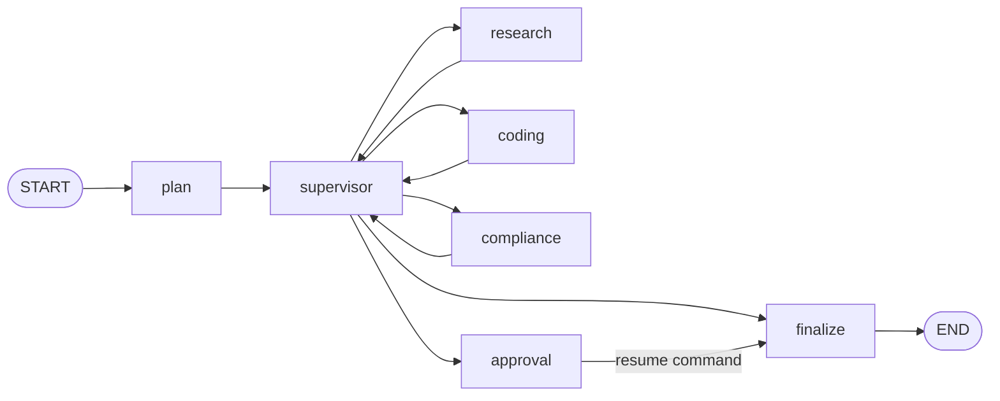

# Phase 2: Stateful Supervisor, Approval, and Streaming

## Goal

Phase 2 implements the central agent-runtime claim: a typed LangGraph supervisor
that delegates to specialist workers, persists every transition, suspends before
policy-sensitive completion, resumes from the same thread after human review,
and emits worker output incrementally.

## Graph topology



The planner derives a minimal worker list from task content and declared risk.
Research is the baseline worker. Coding is added for implementation tasks, and
compliance is added for high-risk or mutation-oriented tasks. After every worker
the graph returns to the supervisor, which makes checkpointed loops and routing
decisions visible rather than hiding orchestration in one function.

## Typed, reducer-aware state

`AgentState` is a `TypedDict` shared by all nodes. Audit entries and completed
worker names use LangGraph reducers so node updates append instead of replacing
history. Partial results are copied and updated by each worker. The state also
stores an iteration counter, a hard loop limit, risk, approval decisions, and the
final status.

The loop limit is a safety invariant. If routing exceeds the caller-bounded
maximum, the graph produces a failed terminal state instead of cycling forever.

## Supervisor and specialist workers

The reference workers are deterministic by design: cloning and running the
project never requires an API key or makes a paid request. Each specialist has a
clear responsibility and can later be replaced through the node boundary with
an LLM-backed implementation.

Workers are asynchronous. They publish tokens through LangGraph's custom stream
writer and yield control between tokens. This demonstrates the same backpressure
and event path used by a streaming chat model without coupling the graph to one
provider.

## Human-in-the-loop checkpoint

High-risk requests always require approval. A caller may also require approval
for any low- or medium-risk request. The approval node calls LangGraph
`interrupt`, which stores the full state in the injected checkpointer and returns
an approval payload to the API. No in-process coroutine is held open.

The approval endpoint resumes the same thread with a LangGraph `Command`. The
node validates that the resume payload contains a Boolean decision. Approval
continues to finalization; rejection produces a terminal rejected result with
reviewer feedback. Attempts to approve unknown or non-suspended runs return 404
and 409 responses respectively.

Phase 2 uses LangGraph's in-memory saver to make local execution and unit tests
self-contained. The runtime owns the saver at application lifespan scope, rather
than recreating it per request. The persistence interface is injected into the
graph builder so a durable database-backed saver can replace it in deployment.

## API contracts

- `POST /api/v1/agents/runs` starts a run and returns either a completed result
  or a `pending_approval` checkpoint.
- `GET /api/v1/agents/runs/{thread_id}` reads the latest checkpoint.
- `POST /api/v1/agents/runs/{thread_id}/approval` resumes a suspended run.
- `POST /api/v1/agents/runs/stream` emits Server-Sent Events.

The stream starts with `run_started`, emits ordered `token` events that identify
their worker, and ends with the full terminal or pending run state. SSE was
chosen because agent output is server-to-client and does not require a duplex
WebSocket protocol.

## Verification

The Phase 2 tests prove worker selection, result aggregation, automatic high-risk
interrupts, checkpoint inspection, approval resume, rejection, invalid resume
handling, and token-stream ordering. Run all gates with:

```bash
ruff check .
mypy
pytest
```

An interactive approval flow can be exercised with:

```bash
curl -X POST http://localhost:8002/api/v1/agents/runs \
  -H 'content-type: application/json' \
  -d '{"task":"Deploy a payment API","risk_level":"high"}'

curl -X POST http://localhost:8002/api/v1/agents/runs/THREAD_ID/approval \
  -H 'content-type: application/json' \
  -d '{"approved":true,"feedback":"Change window confirmed"}'
```

## Next phase

Phase 3 will add a Redis 8 cache wrapper with canonical exact keys, vector
semantic lookup, TTL, scoped invalidation, stampede protection, statistics, and
a reproducible latency benchmark.
