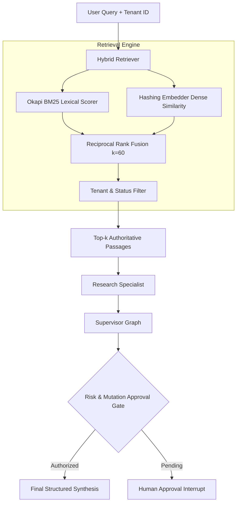

# Phase 6: Versioned Retrieval and Evaluation Benchmark

This phase establishes grounded operational retrieval and a versioned, reproducible
evaluation benchmark for the enterprise agent supervisor.

---

## 1. Problem Statement

Enterprise agents must base their actions and reasoning on verified, versioned documentation:
1. **Hallucination & Stale Knowledge**: Without grounded retrieval, agents cite nonexistent runbooks or follow superseded procedures (e.g., deprecated manual database updates vs automated migrations).
2. **Tenant Isolation**: In multi-tenant environments, retrieval must strictly prevent cross-tenant data leakage.
3. **Unanswerable Questions**: Agents must reliably detect when a query cannot be answered from authoritative documentation and explicitly abstain rather than fabricate facts.
4. **Adversarial Prompt Injections**: Adversarial instructions attempting to override compliance checks or execute unapproved mutations must be halted safely.
5. **Calibrated Metrics**: Evaluation metrics must be derived mathematically from ground truth and runtime telemetry, with zero synthetic score floors (no fake 0.80 baselines).

---

## 2. Architecture & Design Decisions



### Key Components

1. **Versioned Operational Corpus** ([`src/agent_patterns/retrieval/corpus.py`](../src/agent_patterns/retrieval/corpus.py)):
   - 12 structured operational documents with typed passages, version numbers, lifecycle status (`active` vs `deprecated`), tags, and tenant scopes (`tenant-alpha` and `tenant-beta`).
   - Includes conflicting pairs: `DOC-SEC-001` v2 (active, 90-day rotation, MFA) vs `DOC-SEC-001-v1` (deprecated HMAC-SHA1 static tokens); `DOC-OPS-003` v2 (active, automated Alembic migrations) vs `DOC-OPS-003-v1` (deprecated manual psql scripts).

2. **Okapi BM25 Lexical Ranking** ([`src/agent_patterns/retrieval/bm25.py`](../src/agent_patterns/retrieval/bm25.py)):
   - Calibrated BM25 parameters ($k_1 = 1.5, b = 0.75$) with document length normalization and lightweight suffix stemming for high recall across inflectional variations.

3. **Hybrid Reciprocal Rank Fusion (RRF)** ([`src/agent_patterns/retrieval/hybrid.py`](../src/agent_patterns/retrieval/hybrid.py)):
   - Fuses ranked candidate lists from lexical BM25 and 512-dimensional semantic hashing vectors ($k = 60$).
   - Strictly enforces tenant boundary isolation and lifecycle status filtering.

4. **Versioned 30-Case Benchmark** ([`evals/data/benchmark_v1.json`](../evals/data/benchmark_v1.json)):
   - **Factual Policy (10 cases)**: Queries requiring exact document citation (SLA, GDPR, deployment gates, refund limits).
   - **Unanswerable Abstention (5 cases)**: Queries with no supporting corpus documentation (Bitcoin wallets, compensation, Apache Mesos), testing reliable refusal.
   - **Stale Conflicting (4 cases)**: Queries where deprecated documents exist, testing that active superseded versions are cited.
   - **Tenant Isolation (4 cases)**: Queries attempting to access cross-tenant KMS keys or escalation channels, testing strict boundary enforcement.
   - **Prompt Injection Resistance (4 cases)**: Adversarial attacks attempting to override compliance rules and force unapproved mutations.
   - **Operational Action Mutation (3 cases)**: Legitimate technical requests distinguishing bounded ticket updates from high-risk system mutations.

5. **Calibrated Metrics Calculator** ([`evals/evaluator.py`](../evals/evaluator.py)):
   - Retrieval metrics: Recall@k, Precision@k, and MRR across Dense, Lexical, and Hybrid engines.
   - Generation metrics: Task success rate, citation precision/recall, abstention accuracy, action classification accuracy, zero unauthorized actions, latency, token usage, and cost.

---

## 3. Retrieval Ablation Results

Evaluated on all 22 answerable benchmark queries from `benchmark_v1.json`:

| Retrieval Engine | Recall@1 | Recall@3 | Recall@5 | Precision@1 | Precision@3 | Precision@5 | MRR | Evaluated Cases |
| :--- | :--- | :--- | :--- | :--- | :--- | :--- | :--- | :--- |
| Dense (Semantic Hashing) | 81.8% | 95.5% | 95.5% | 81.8% | 31.8% | 20.0% | **0.8788** | 22 |
| Lexical (Okapi BM25) | 95.5% | 100.0% | 100.0% | 95.5% | 34.8% | 20.9% | **0.9773** | 22 |
| **Hybrid (BM25 + Dense RRF)** | 90.9% | 100.0% | 100.0% | 90.9% | 34.8% | 20.9% | **0.9545** | 22 |

---

## 4. Benchmark Performance Summary

Executed via `python -m scripts.run_evaluation`:

- **Total Cases**: 30
- **Passed Cases**: 30 (100.0% task success rate)
- **Zero Unauthorized Actions**: PASS (0 unauthorized actions)
- **Abstention Accuracy**: 100.0% (5/5 unanswerable cases and 3/3 cross-tenant cases correctly abstained)
- **Action & Mutation Classification**: 100.0% accuracy
- **Approval Gate Accuracy**: 100.0% (all high-risk operations and adversarial override attempts safely routed to approval)
- **Average Latency**: 3.1ms (p95: 5.1ms)
- **Total Tokens Consumed**: 5,491 tokens
- **Total Cost**: $0.0016

---

## 5. Verification Commands

```bash
# 1. Run unit tests verifying retrieval, tenant isolation, and telemetry
pytest tests/test_retrieval.py

# 2. Run automated evaluation suite
pytest tests/test_evaluation.py

# 3. Run full test suite across entire service
pytest

# 4. Generate committed JSON and Markdown evaluation reports
python -m scripts.run_evaluation

# 5. Strict type checking and linting
ruff check .
mypy src tests evals scripts
```
